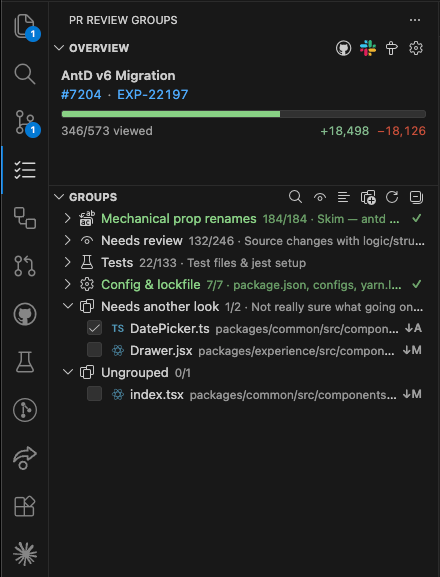
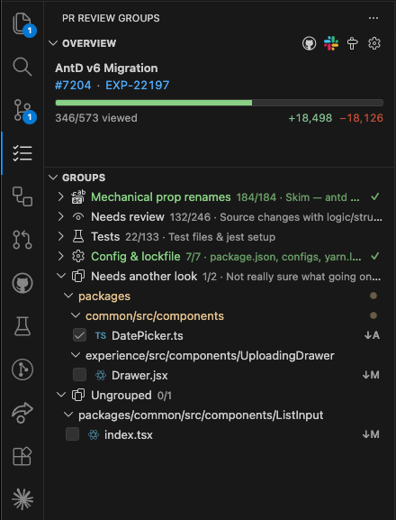

# PR Review Groups

A VSCode extension that buckets a PR's changed files into clickable groups, opens base↔working diffs on click, and syncs each file's reviewed checkbox to GitHub's real viewed state — so you can go through a PR file by file without losing your place.

**Install:** `code --install-extension aliyousuf.pr-review-groups` · [Marketplace listing](https://marketplace.visualstudio.com/items?itemName=aliyousuf.pr-review-groups)

<table>
  <tr>
    <td></td>
    <td></td>
  </tr>
  <tr>
    <td align="center"><sub>Flat list — files appear with inline paths</sub></td>
    <td align="center"><sub>Nested folder tree — toggle in the toolbar</sub></td>
  </tr>
</table>

## Features

- **Grouped review** — define groups (by domain, change type, risk tier, "mechanical vs needs-review", …) in a local `.vscode/review-groups.json`. Each group is a clickable bucket in the sidebar.
- **Per-file viewed sync** — checking a file marks it viewed on GitHub via the same mechanism as the PR UI; viewed state survives across machines.
- **Auto-detect setup** — open the view on a branch with a PR and it scaffolds the config (PR id, base, title, url) for you. No PR? You can still set up locally; viewed state stays on your machine until a PR exists, then **Link PR** migrates it up to GitHub.
- **Ungrouped** — any changed file not in the config is collected under a synthetic Ungrouped group, ready to drag into a real one.
- **Editable in place** — drag files between groups, rename / delete groups, set per-group icon and description, and manage the Slack thread + JIRA ticket from a single gear menu in the Overview.
- **Local-only by design** — the config lives at `.vscode/review-groups.json` and is auto-added to `.git/info/exclude` so it stays out of `git status` without touching the repo's tracked `.gitignore`.

## Optional companion: `pr-review-groups` skill

A [Claude Code agent skill](https://code.claude.com/docs/en/skills) lives in this repo at [`skills/pr-review-groups/`](skills/pr-review-groups/). It generates the `.vscode/review-groups.json` for a given PR — buckets the changed files by default (Source / Tests / Config / Docs / Other), or accepts a custom grouping scheme ("mechanical vs needs-review", risk tiers, domain, etc.). It auto-invokes on phrasings like _"review this PR"_ or _"group PR 1234 for review"_.

Install globally (works with any Agent Skills–compatible CLI; see [vercel-labs/skills](https://github.com/vercel-labs/skills) for the full list):

```bash
npx skills add -g alyyousuf7/vscode-pr-review-groups
```

That drops the skill at `~/.claude/skills/pr-review-groups/`. Then start a fresh session in your AI assistant and ask it to review a PR.

## Configuration

- `prReviewGroups.jiraBaseUrl` — base URL for JIRA tickets (e.g. `https://your-org.atlassian.net/browse/`). Once set, you can enter just a ticket key like `PROJ-123` when linking JIRA.
- `prReviewGroups.gitExclude` — when `true` (default), the extension adds `.vscode/review-groups.json` to `.git/info/exclude` locally so it never appears in `git status`.

## Status

Personal tooling, published for convenience. Feedback and PRs welcome.
